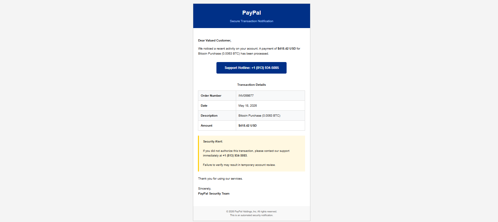

# 🎣 Phishing Email Investigation and IOC Extraction

  

## 📌 Overview

This project documents the investigation of a PayPal-themed callback phishing email. The analysis focused on email header examination, phishing detection, social engineering techniques, and extraction of Indicators of Compromise (IOCs).

The phishing email attempted to impersonate PayPal by claiming a Bitcoin purchase had been made and urged the recipient to contact a fraudulent support number.

---

## 🎯 Objectives

* Analyze email headers
* Identify phishing indicators
* Extract Indicators of Compromise (IOCs)
* Investigate sender infrastructure
* Analyze social engineering techniques
* Document findings in a professional report

---

## 🚨 Attack Summary

| Field              | Value                            |
| ------------------ | -------------------------------- |
| Attack Type        | Callback Phishing (TOAD)         |
| Impersonated Brand | PayPal                           |
| Subject            | Review Recent Activity           |
| Theme              | Fake Bitcoin Purchase            |
| Goal               | Victim calls scam support number |

---

## 🔍 Key Findings

✅ Sender domain was not associated with PayPal.

✅ Email used a fake Bitcoin transaction to create urgency.

✅ SPF authentication passed because the attacker controlled the sending domain.

✅ The primary call-to-action was a phone number instead of a login page.

✅ No malware or malicious attachments were present.

✅ Attack relied entirely on social engineering.

---

## 🕵️ Indicators of Compromise (IOCs)

  

---

## 🛡️ MITRE ATT&CK Mapping

| Technique | Description              |
| --------- | ------------------------ |
| T1566.001 | Phishing                 |
| T1204     | User Execution           |
| T1598     | Phishing for Information |

---

## 📊 Investigation Report

  

---

## 📸 Evidence

The repository contains:

* Email screenshots
* Sanitized email sample (.eml)
* Sanitized email headers
* IOC documentation
* Detailed investigation report

---

## 💻 Skills Demonstrated

* Email Header Analysis
* Phishing Detection
* IOC Extraction
* Threat Intelligence
* Social Engineering Analysis
* Incident Documentation
* Security Investigation
* MITRE ATT&CK Mapping

---

## 🛠️ Tools Used

* Gmail
* Visual Studio Code
* GitHub
* Manual Header Analysis
* MITRE ATT&CK Framework

---

## ⚠️ Disclaimer

This repository is intended for cybersecurity education, phishing awareness, and SOC analyst skill development. All personal information has been removed or sanitized before publication.
